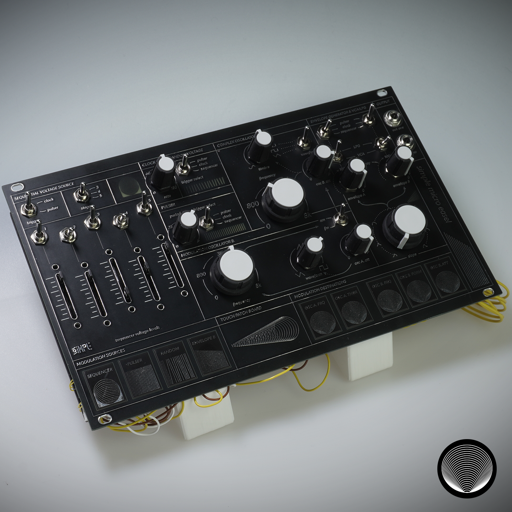

# Canvas

# Description

This repository is about the Canvas, a synthesizer made with the Simple kit by Synthux Academy and a daisy seed by electro smith inspired by Buchla's Easel. 
- [Synthux Academy](https://www.synthux.academy)
- [Simple Synth Manual](https://tsemah.notion.site/Simple-Synth-Manual-4c2899938eb84fad988319995ea5fe3b)
- [Daisy Seed](https://www.electro-smith.com/daisy/daisy)

## About

We all know Bob Moog and its synthesizer but in the 60s, another synth pioneer was creating an innovative synthesizer: Don Buchla.

Opposite to Moog and its more classical approach to its instruments, Buchla had more of an experimental approach.

One of the most known Buchla synthesizers is named "Buchla Music Easel", a semi-modular synthesizer released in 1973.

With the Canvas, we tried to take the essence of what makes the Easel such an excellent experimental synthesizer in a more compact form factor thanks to the simple board.

## Technical description

The Canvas sound generation is based on two oscillators, the complex, and the modulation oscillator. The latter can modulate the complex osc either in amplitude or frequency. Those oscillators are routed to either LPGs or VCAs triggered by two distinct envelopes.

With only the oscillators and VCA/LPG, the synthesizer is quite dull. To make it more dynamic, we introduce modulation touch patches that can change dynamically oscillators parameters by connecting them to one of the four modulation sources:

- a 5 steps sequencer
- a pulser (sawtooth signal)
- random voltage generator
- the envelope of the modulation osc

In addition, the sequencer, random voltage, pulser, and envelopes can be triggered by a different source: the clock, pulser, and sequencer. This feature lets you have three distinct tempos running in the instrument.

### Sync the Canvas with your setup using eurorack module

It is possible to use the eurorack module [MIDI-sync-power-dev-board](https://github.com/lucblender/MIDI-sync-power-dev-board) to power up the canvas and use a sync in and MIDI input.

More information on how to wire the Canvas to the MIDI-sync-power-dev-board at the end of the [how to build instructions](HOW_TO_BUILD.md).

# Requirement

The Canvas is made using Arduino IDE. You'll need the following dependencies:

- The full Daisyduino toolchain: [Getting Started (Arduino Edition)](https://github.com/electro-smith/DaisyWiki/wiki/1a.-Getting-Started-(Arduino-Edition))
- [Daisyduino library](https://github.com/electro-smith/DaisyDuino) by stephenhensley
- [Adafruit_MPR121](https://github.com/adafruit/Adafruit_MPR121) by Adafruit
- [Adafruit_MCP23017](https://github.com/adafruit/Adafruit-MCP23017-Arduino-Library) by Adafruit
- [Adafruit_NeoPixel](https://github.com/adafruit/Adafruit_NeoPixel) by Adafruit
## Code

Two codes are provided in this repo, the main Canvas and a hardware test code to help you test and debug when building your Canvas.

# Instruction to build

You can find all the instruction to build your own Canvas in the [how to build instructions](HOW_TO_BUILD.md).